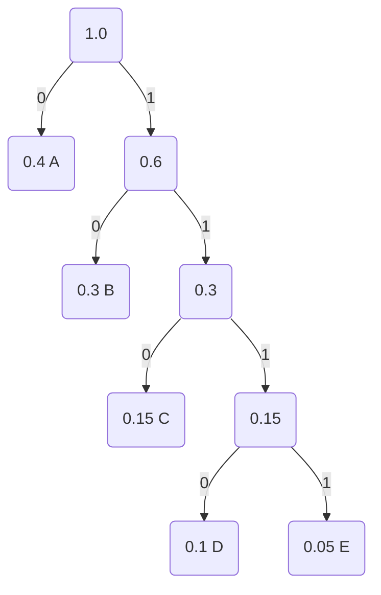

---

exports:
  - format: pdf
    template: plain_latex
    output: ./exports/section7.pdf
downloads:
  - file: ./exports/section7.pdf
    title: PDF
title: Section 7 - Codage de source
abstract: |
  Cette section traite des principes du codage de source appliqués aux systèmes de communication numériques. Elle aborde les techniques visant à réduire la redondance des données, à compresser efficacement l'information et à approcher les limites théoriques fixées par l'entropie de Shannon. Le but est de comprendre comment optimiser la représentation des données pour minimiser l'utilisation des ressources de transmission tout en préservant l'intégrité de l'information.
   

---

## Introduction 


Le **codage de source** vise à améliorer la représentation des données en réduisant leur redondance tout en préservant leur contenu informatif. Cette amélioration est essentielle pour minimiser l'utilisation des ressources de communication, telles que la largeur de bande et l'énergie, tout en garantissant une transmission efficace et fiable. L’objectif principal du codage de source est d’atteindre une compression maximale des données tout en respectant les limites théoriques établies par l’entropie de Shannon (plus d'informations à venir). Ces concepts ont été proposés par Claude Shannon, dans son célèbre article intitulé «A Mathematical Theory of Communication». REF: https://fr.wikipedia.org/wiki/A_Mathematical_Theory_of_Communication 

Le codage de source est une technique essentielle pour réduire les besoins en ressources tout en maintenant l’intégrité des données. Les critères de performance clés du codage de source incluent la longueur moyenne des codes, qui doit être proche de l’entropie de la source, ainsi que la variance des longueurs de code, qui reflète la régularité des représentations. Ces métriques permettent d'évaluer l'efficacité d'un algorithme de codage et son adaptabilité aux caractéristiques statistiques des données, garantissant ainsi une transmission améliorée dans des systèmes de communication modernes.


En télécommunications, une [source](#def-source) génère des données qui doivent être transmises ou stockées. Ces sources peuvent être classées en sources continues et sources discrètes, selon la nature des données produites. 
Le codage de source s’applique uniquement aux sources discrètes. Les sources continues, bien qu'importantes dans les communications, nécessitent une étape de [numérisation](#S3-numerisation) pour être adaptées au codage de source.  Cette distinction met en évidence le rôle central des données discrètes dans la conception des systèmes de communication modernes.

 

### Paramètres d’une source discrète

(def-DiscSource)=
Définition:  Une  **source discrète** (*discrete source*) produit des séquences de données distincts, chacun ayant une probabilité d’occurrence. Ces symboles sont générés en fonction des caractéristiques statistiques de la source.


Propriétés : 
- **L’ensemble des symboles** $\mathcal{S}$ représente toutes les valeurs possibles qu’une source discrète peut produire.

:::{note} Exemple illustratif :   
-  Pour une source textuelle en français : $\mathcal{S}= \{A, B, C, \dots, Z\} $.
-  Pour une source binaire : $\mathcal{S} = \{0, 1\} $.
::: 


- **La probabilité d'occurence** $ p_i $ d’un symbole $ s_i $ représente la fréquence relative avec laquelle ce symbole apparaît dans la sortie de la source. Notez que
$$
 \sum_{i=1}^{K} p_i = 1, 
 $$
 où $ K $ est le nombre total de symboles dans l’ensemble $\mathcal{S}$.

:::{note} Exemple illustratif : 
-   Pour une source textuelle en anglais :
  $ p(\text{E}) = 0.13 $,  $ p(\text{T}) = 0.09 $, $ p(\text{Z}) = 0.0007$.
-  Pour une source binaire équiprobable : $ p(0) = 0.5 $, $ p(1) = 0.5 $.
 :::
 


 


    
### Entropie de Shannon

Avec sa théorie, Shannon a introduit une technique pour quantifier l'information. Nous les définirons ici.

 
(def-Info)=
Définition: **L’information** apportée par une donnée $ s_i $, en bits, est inversément proportionnelle à sa probabilité d’occurrence. Elle est donnée par :
$$
I(s_i) = \log_2 \frac{1}{p_i} = -\log_2 p_i  \;\;\;\; \textrm{ bits} 
$$

Notez que les symboles fréquents contiennent moins d’information quand $I(s_i)$ est faible, et les symboles rares contiennent plus d’information quand $ I(s_i)$ est élevé.


:::{note} Exemple illustratif :   
- Pour $p(\text{A}) = 0.5 $, $ I(\text{A}) = \log_2 \frac{1}{0.5} = 1 \, \text{bit} $.
- Pour $p(\text{Z}) = 0.01 $, $ I(\text{Z}) = \log_2 \frac{1}{0.01} = 6.64 \, \text{bits} $.
:::


  
(def-Entropie)=
Définition: 
**L’entropie** (*entropy*) de la source $H(\mathcal{S})$ est la quantité moyenne d’information produite par symbole. Elle représente une mesure de l’incertitude ou de la redondance d’une source discrète. Elle est définie par :
$$
H(\mathcal{S}) = -\sum_{i=1}^{K} p_i \log_2 p_i  \;\;\;\; \textrm{ bits} 
$$

Une source avec des symboles équiprobables (tous les symboles ont des probabilités égales), donc $p_i = \frac{1}{K}$ a une entropie maximale $H(\mathcal{S}) = \log_2 K$. Aucune autre source disposant de $K$ données ne peut créer une entropie plus élevée.  


$ H(\mathcal{S}) = 0 $ si un seul symbole a une probabilité de 1 (source déterministe). Cela signifie qu'il n'y a pas d'incertitude associée à cette source. 


:::{note} Exemple illustratif : 
- Pour une source binaire équilibrée ($ p(0) = 0.5 $, $p(1) = 0.5 $) :
$$
  H(\mathcal{S}) = -(0.5 \log_2 0.5 + 0.5 \log_2 0.5) = 1 \, \text{bit}.
$$
- Pour une source de text avec $ p(\text{A}) = 0.6 $, $ p(\text{B}) = 0.3 $, $ p(\text{C}) = 0.1 $ :
$$
  H(\mathcal{S}) = -(0.6 \log_2 0.6 + 0.3 \log_2 0.3 + 0.1 \log_2 0.1) \approx 1.485 \, \text{bits}.
$$
:::


 


## Codage de source

Le **codage de source** peut être interprété comme une technique d’étiquetage où chaque symbole produit par une source discrète est associé à une séquence binaire unique (un code). Ce processus vise à réduire la longueur moyenne des codes attribués aux symboles, en fonction de leurs probabilités d’occurrence.

L'objectif est d'associer à chaque symbole $ s_k $ **un mot de (code binaire)**,  exprimé par  $\bf{d}_k$  de longueur $ l_k $, comme:

```{list-table}
:header-rows: 1

* - Donnée
  - $D_1$
  - $D_2$
  - $\ldots$
  - $D_K$
* - Probabilité
  - $p_1$
  - $p_2$
  - $\ldots$
  - $p_K$
* - Mot de code
  - $\mathbf{d}_1$
  - $\mathbf{d}_2$
  - $\ldots$
  - $\mathbf{d}_K$
* - Longueur du code
  - $l_1$
  - $l_2$
  - $\ldots$
  - $l_K$
```


:::{note} Exemple illustratif : 
Pour une source générant les symboles $ A, B, C, D $ avec des probabilités;
$
p_A = 0.4, \, p_B = 0.3, \, p_C = 0.2, \, p_D = 0.1,
$
le codage de source attribue les mots de code suivants :
- $ \bf{d}$$_A = 0 $, $ l_A = 1 $,
- $ \bf{d}$$_B = 10 $, $ l_B = 2 $,
- $ \bf{d}$$_C = 110 $, $ l_C = 3 $,
- $ \bf{d}$$_D = 111 $, $ l_D = 3 $.
:::

### Critères de performance d'un codeur de source

Pour évaluer son efficacité, plusieurs critères de performance sont pris en compte, comme décrit ci-dessous.  Ces critères permettent d’évaluer l’efficacité et l’adéquation des algorithmes de codage de source pour des applications spécifiques. Un bon algorithme doit minimiser la longueur moyenne des codes et la redondance, tout en maximisant l’efficacité de compression, tout cela avec une complexité raisonnable.


- Longueur moyenne des codes ($\bar{l}$) :

  La longueur moyenne des codes est la moyenne pondérée des longueurs des codes attribués aux symboles de la source, calculée comme 
  $$\bar{l} = \sum_{i=1}^{K} p_i l_i \;\;\;\; \textrm{ bits}  $$
  L'objectif est de minimiser  $\bar{l}$ tout en garantissant un codage décodable de manière unique. Notez que même si $\bar{l}$ n'est pas un nombre entier, chaque valeur de $l_i$ doit être un nombre entier.  


:::{note} Exemple illustratif :  
Considérons une source avec trois symboles $S = \{A, B, C\}$ ayant les probabilités $p_A = 0.5$, $p_B = 0.3$, $p_C = 0.2$, et les longueurs de codes $l_A = 1$, $l_B = 2$, $l_C = 3$. La longueur moyenne des codes est :
   $$
    \bar{l} = (0.5 \times 1) + (0.3 \times 2) + (0.2 \times 3) = 1.7  \, \text{bit}.
 $$

L’entropie est la limite inférieure théorique pour la longueur moyenne des codes, donc
 $$ \bar{l} \geq H(\mathcal{S})  $$ 
:::


- Variance des Longueurs de Codes ($\sigma_l^2$) : 

  La variance mesure la dispersion des longueurs des codes autour de la moyenne 
    $$
    \sigma_l^2 = \sum_{i=1}^{K} p_i (l_i - \bar{l})^2  \hspace{1cm}  \text{ bits$^2$}.
    $$
   L'objectif est de  réduire la variance pour garantir une régularité dans les longueurs des codes. Une variance faible simplifie la synchronisation et le décodage.

:::{note} Exemple illustratif :   
Avec les mêmes données :
   $$
    \sigma_l^2 = (0.5 \times (1 - 1.7)^2) + (0.3 \times (2 - 1.7)^2) + (0.2 \times (3 - 1.7)^2) \approx 0.41 \text{ bits$^2$}
   $$
:::


- Redondance 
  La redondance mesure l’écart entre la longueur moyenne des codes et l’entropie 
   $$ R = \bar{l} - H(\mathcal{S}) \hspace{1cm} \text{bits}$$


    L'objectif est de  réduire la redondance pour se rapprocher de l’efficacité optimale ($\bar{l} \approx H(\mathcal{S})$).


:::{note} Exemple illustratif :  
Avec les mêmes symboles et probabilités que ci-dessus :
     $$
    H(\mathcal{S}) = -(0.5 \log_2 0.5 + 0.3 \log_2 0.3 + 0.2 \log_2 0.2) \approx 1.485 \text{ bits}.
     $$
Avec $\bar{l} = 1.7$ et $H(\mathcal{S}) = 1.485$, la redondance est :
     $$
    R = 1.7 - 1.485 = 0.215 \text{ bits}.
     $$
:::

\subsubsection{Efficacité de compression}
 L’efficacité de compression est le rapport entre l’entropie et la longueur moyenne des codes :
 \FF{FF}{  $\text{Efficacité de compression} = \frac{H(\mathcal{S})}{\bar{l}} \times 100\%.$}
    
    
    On veut maximiser l’efficacité de compression.

:::{note} Exemple illustratif :  
Avec $H(\mathcal{S}) = 1.485$ et $\bar{l} = 1.7$, l’efficacité est :
    $$
    \text{Efficacité de compression} = \frac{1.485}{1.7} \times 100 \approx 87.35\%.
    $$
:::    


- Taux de Compression

   Pour un fichier, taux de compression mesure la réduction de la taille des données grâce au codage
$$  \text{Taux de compression} = \frac{\text{Taille originale}}{\text{Taille compressée}}. $$

  L'objectif est d'obtenir un taux de compression élevé sans perte de données pour le codage sans perte. Dans le cas limite d'un grand nombre de données générées, le taux de compression devient égal à l'efficacité de la compression.

:::{note} Exemple illustratif :  
Un fichier texte compressé avec un taux de 4 signifie que sa taille est divisée par 4.
:::    

-  Complexité de codage et décodage

   La complexité est évaluée par le temps et les ressources nécessaires pour encoder ou décoder les données.
  
    On veut réduire la complexité tout en maintenant une efficacité élevée.
 
:::{note} Exemple illustratif : 
Le codage de Huffman a une complexité logarithmique pour le décodage ($O(\log K)$). Le codage de Huffman est expliqué dans la section suivante. 
 
 La notation $O(\cdot)$ et les détails sont hors  de contenu du cours.
:::

## Codage de Huffman


Le **codage de Huffman** est une méthode de codage de source optimale basée sur les probabilités des symboles. C'est-à-dire que les codes de Huffman donnent la longueur de code moyenne, $\bar{l}$, la plus courte possible.
Un codage optimal comme Huffman attribue des codes plus courts aux symboles fréquents pour réduire .


Elle attribue des codes binaires plus courts aux symboles fréquents et des codes plus longs aux symboles rares.   Le codage de Huffman, avec ses applications dans le texte, les images et les vidéos, constitue une méthode efficace pour atteindre cet objectif. Cette approche illustre la manière dont les principes mathématiques, tels que l’entropie de Shannon, se traduisent en solutions pratiques pour les défis des télécommunications modernes.

```{tip} Algorithme pour le codage de Huffman
1.  Construction de l’arbre de codage :
 
    1.1.  Trier les données par ordre décroissant de probabilité ; chaque donnée engendre une branche de l’arbre.

    1.2.  Associer les bits « 0 » et « 1 » aux deux branches les moins probables et relier celles-ci pour en former une seule.

    1.3. L’arbre est-il réduit à deux branches ?  Si oui, continuer ;  sinon, aller à 2.

    1.4.  Associer les bits « 0 » et « 1 » aux deux branches restantes.

2. Obtention du tableau de codage :

    2.1  Lire le code de chaque donnée de droite à gauche sur l’arbre.
 
```


 


:::{note} Exemple illustratif :  
Considérons une source discrète ayant les symboles et probabilités suivantes :
$$
S = \{A, B, C, D, E\}, \quad P = \{p_A = 0.4, p_B = 0.3, p_C = 0.15, p_D = 0.1, p_E = 0.05\}.
$$

 **1. Construction de l’Arbre de Codage**

1.1. Trier les données par ordre décroissant de probabilité
  - Liste initiale classée par ordre croissant de probabilité (comme en codage Huffman) :
  $$
  E (0.05), \quad D (0.1), \quad C (0.15), \quad B (0.3), \quad A (0.4)
  $$

 1.2. Associer les bits « 0 » et « 1 » aux deux branches les moins probables
  - Fusionner $E$ et $D$ :
    - Probabilité combinée : $p(E) + p(D) = 0.05 + 0.1 = 0.15$
    - Nouvelle liste : $(ED, 0.15), C (0.15), B (0.3), A (0.4)$

  - Fusionner $(ED)$ et $C$ :
    - Probabilité combinée : $0.15 + 0.15 = 0.3$
    - Nouvelle liste : $(CED, 0.3), B (0.3), A (0.4)$

  - Fusionner $(CED)$ et $B$ :
    - Probabilité combinée : $0.3 + 0.3 = 0.6$
    - Nouvelle liste : $(BCED, 0.6), A (0.4)$

  - Fusionner $(BCED)$ et $A$ :
    - Probabilité combinée : $0.6 + 0.4 = 1.0$
    - Nous avons atteint la racine.

1.3. L’arbre est-il réduit à deux branches ?
- Oui, à la dernière étape, seulement deux branches ($BCED$ et $A$).

1.4. Associer les bits « 0 » et « 1 » aux deux branches restantes
  - On attribue :
    - $0$ pour $A$
    - $1$ pour $BCED$
  - On continue ainsi en descendant l’arbre, en attribuant à chaque nœud "0" pour la branche gauche et "1" pour la branche droite.


**2. Obtention du Tableau de Codage**

2.1. Lire le code de chaque donnée de droite à gauche sur l’arbre
- $A = 0$
- $B = 10$
- $C = 110$
- $D = 1110$
- $E = 1111$

---

**Calculs Associés:** 
- Longueur Moyenne du Code
Les longueurs de chaque code sont :
$$
l_A = 1, \quad l_B = 2, \quad l_C = 3, \quad l_D = 4, \quad l_E = 4
$$

- Calcul de la longueur moyenne :
$$
\bar{l} = (0.4 \times 1) + (0.3 \times 2) + (0.15 \times 3) + (0.1 \times 4) + (0.05 \times 4) = 2.05 \, \text{bits}
$$

- Comparaison avec l’Entropie
Calcul de l'entropie de la source :
$$
H(\mathcal{S}) = -(0.4 \log_2 0.4 + 0.3 \log_2 0.3 + 0.15 \log_2 0.15 + 0.1 \log_2 0.1 + 0.05 \log_2 0.05) \approx 2.029 \, \text{bits}
$$

Notez que  $\bar{l} = 2.05$ est très proche de $H(\mathcal{S}) = 2.029$, montrant l'efficacité du codage Huffman.

---

**Arbre de Codage**



 

**Application**

Si un fichier contient $50\,000$ caractères codés initialement sur $7$ bits :
- Taille initiale :
$$
50,000 \times 7 = 350,000 \, \text{bits}
$$

Après codage Huffman (en supposant une entropie de $H(\mathcal{S}) = 4$ bits) :
- Taille comprimée approximative :
$$
50,000 \times 4 = 200,000 \, \text{bits}
$$

Donc, une réduction significative de la taille du fichier est obtenue.

:::

Le codage de source en tant que technique d’étiquetage attribue des séquences binaires aux symboles d’une source discrète, en optimisant la longueur moyenne des codes ($ \bar{l} $) pour minimiser la redondance. Cette approche repose sur les probabilités des symboles ($ p_k $) et leur relation avec l’information contenue ($ I(s_k) $). Le résultat est une représentation efficace des données qui utilise des codes courts pour les symboles fréquents et des codes plus longs pour les symboles rares, respectant les contraintes de décodage unique et d’optimisation de la compression.

## Resumé

Cette section  traite de  **O7.**  *Choix des techniques de codage de source adaptées à la compression
des informations*. Elle aborde les techniques visant à réduire la redondance des données, à compresser efficacement l'information et à approcher les limites théoriques fixées par l'entropie de Shannon. Le but est de comprendre comment optimiser la représentation des données pour minimiser l'utilisation des ressources de transmission tout en préservant l'intégrité de l'information.

